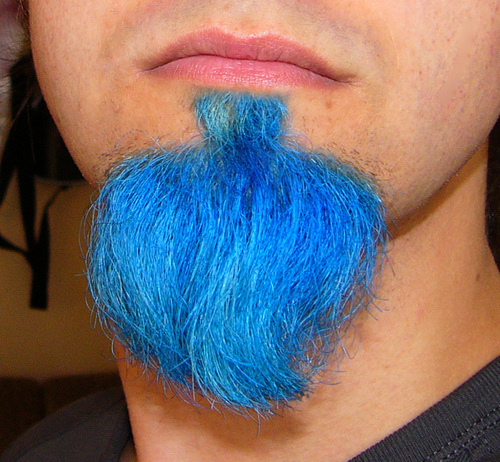
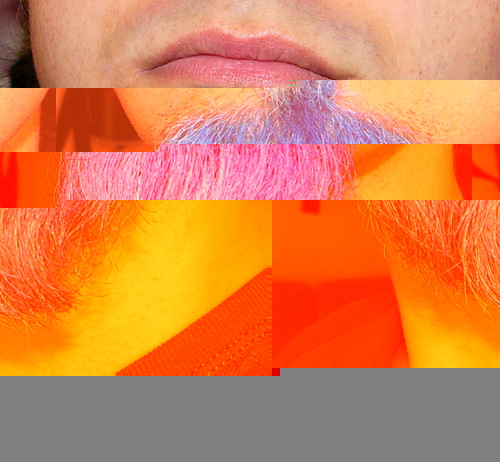

# breakthejpeg
A very important tool to glitch JPEGs and then upload them as twitter avatars.

The glitching happens by simply deleting a few random bytes from the JPEG files. 

I want this script to be able to upload the generated image as Twitter avatar as well, let's hope I come around to it soonish.

## Example

<table style="width:100%">
<tr>
<td>

</td>
<td>
➡️
</td>
<td>

</td>
</tr>
</table>

## Usage
From Terminal

    python breakthejpeg.py source.jpg glitch.jpg